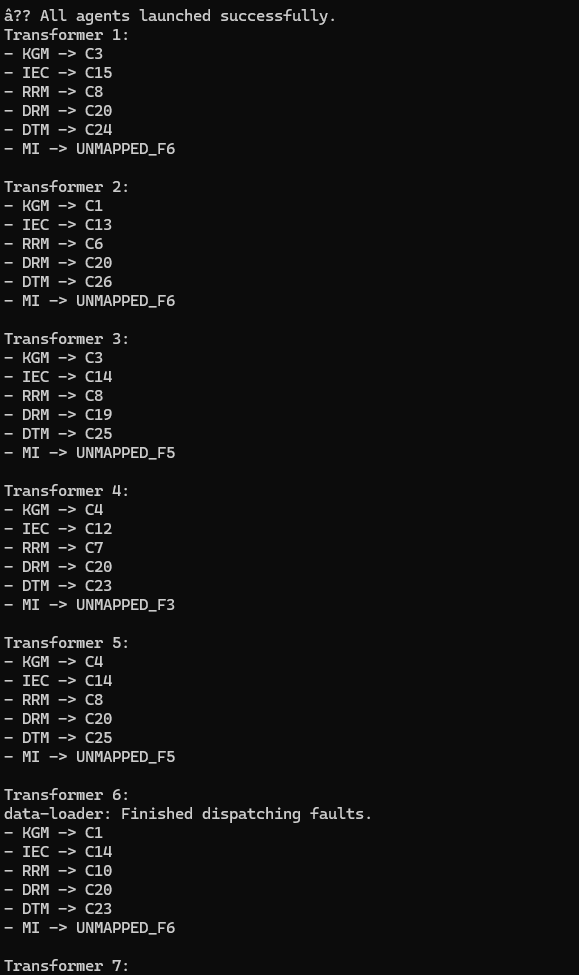

# Transformer Fault Diagnosis System (JADE Multi-Agent System)

## 🔍 Overview

This system uses an intelligent multi-agent approach (via JADE) to standardize transformer fault diagnostics. It reads diagnostic outputs from multiple DGA (Dissolved Gas Analysis) methods and converts them into unified fault labels using a custom rule-based mapping.

The goal is to simplify transformer fault interpretation, enabling engineers to act more confidently on maintenance decisions.

---

## 📊 Problem Statement

Different diagnostic methods (like Key Gas, IEC, Rogers, etc.) produce fault codes in varying formats (`F1`, `F5`, etc.).

This system:

1. Ingests those fault codes from a CSV file.
2. Uses pre-defined mappings to translate them into standardized labels (`C1` to `C26`).
3. Outputs the translated results in a readable format.

---

## 📁 Folder Structure

```
TransformerDiagnosisSystem/
├── src/dga/
│   ├── DataLoaderAgent.java
│   ├── DGAMapperAgent.java
│   ├── ResultAggregatorAgent.java
│   ├── Messages.java
│   └── MainContainer.java
│
├── data/
│   ├── fault_codes.csv          # Input from client
│   ├── mappings.csv             # Mapping rules (F1-F6 -> C1-C26)
│
├── lib/
│   └── jade.jar                 # JADE runtime
│
├── bin/                         # Compiled class files
├── compile_run.bat             # Run script (for Windows)
└── README.txt                  # You're reading it
```

---

## 🔧 System Components (Agents)

| Agent Name            | Role                                                      |
| --------------------- | --------------------------------------------------------- |
| DataLoaderAgent       | Loads CSV data, sends fault info to mappers               |
| DGAMapperAgent (x6)   | One per method: KGM, IEC, RRM, DRM, DTM, MI               |
| ResultAggregatorAgent | Collects standardized labels per sample and displays them |

---

## ⚡ How It Works

1. `DataLoaderAgent` reads `fault_codes.csv` (25 samples, 6 methods per row).
2. For each method (`KGM`, `IEC`, etc.), it sends fault codes to the matching mapper agent.
3. Each `DGAMapperAgent` maps its fault codes (`F1` to `F6`) to a standard label (`C1` to `C26`).
4. Results are sent to the `ResultAggregatorAgent`.
5. Final output for each transformer sample is printed in the console.

---

## 📄 Example Input/Output

**Input (`fault_codes.csv`):**

```
S/N,KGM,IEC,RRM,DRM,DTM,MI
1,F5,F5,F4,F6,F4,F6
2,F2,F3,F2,F6,F6,F6
```

**Mapping (`mappings.csv`):**

```
KGM_F5=C3
IEC_F5=C15
RRM_F4=C8
DRM_F6=C20
DTM_F4=C24
```

**Console Output:**

```
Sample 1: {KGM=C3, IEC=C15, RRM=C8, DRM=C20, DTM=C24, MI=F6}
Sample 2: {KGM=C1, IEC=C13, RRM=C6, DRM=C20, DTM=C26, MI=F6}
```

**Screenshots**

## 

## 🚀 How to Run (Windows)

1. Ensure `Java` is installed (JDK 8 or later)
2. Place your CSV files inside the `data/` folder
3. Double-click `compile_run.bat` OR run in terminal:

```
javac -cp lib/jade.jar -d bin src/dga/*.java
java -cp bin;lib/jade.jar dga.MainContainer
```

---

## 🔹 How to Use With New Data

To test your own transformer samples:

- Replace `fault_codes.csv` with your own file (must follow same format)
- Keep `mappings.csv` unchanged unless you update rules
- Run the system and check console for output

---

## 🌟 Value to Client

This system enables you to:

- Interpret diverse diagnostic outputs in one standardized format
- Easily test with your own DGA data
- Reuse the system for more transformers without modification

---

## 📆 Contact & Support

Need help running the system or customizing it?

> Phone: \[??]
> Delivered: June 2025

Thank you!
